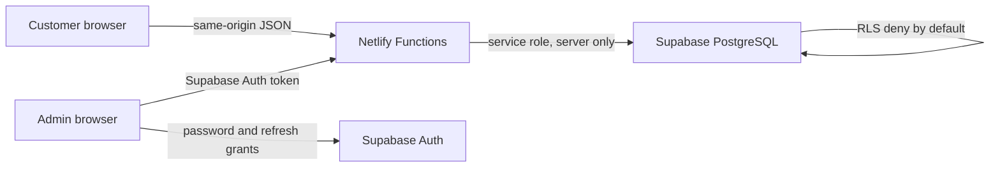

# VELORA Detail Lab

Production-ready Supabase booking backend for the existing VELORA React website. The storefront design, responsive behavior, price estimator, and EN/LV/RU content are preserved.

Public site: <https://autodetailing-velora.netlify.app/>

## Architecture



- `src/` contains the existing storefront, API booking form, and protected `/admin` area.
- `netlify/functions/create-booking.ts` is the only public booking write boundary.
- `supabase/migrations/` creates the schema, RLS, atomic rate limits, transactional booking insertion, and audited admin updates.
- `supabase/seed.sql` loads the vehicle, service, package, bay, and business-hours catalog.
- `supabase/test-data.sql` is optional fictional data for local or staging testing only.

## Local setup

```bash
npm ci
copy .env.example .env
npm run dev
```

Do not commit `.env`. The production booking path is the default; use `VITE_SUBMISSION_MODE=demo` only for isolated frontend work.

Verification:

```bash
npm run lint
npm run test
npm run test:schema
npm run build
```

## Supabase setup

Apply the files in order to the existing Supabase project. The first and third
migrations preserve and upgrade records from the earlier Phase 2 schema when it
is present; they are safe no-ops for a new project:

1. `202608130000_prepare_legacy_phase2.sql`
2. `202608130001_booking_schema.sql`
3. `202608130002_copy_legacy_phase2.sql`
4. `202608130003_booking_functions.sql`
5. `202608130004_admin_functions.sql`
6. `supabase/seed.sql`

With the Supabase CLI:

```bash
supabase link --project-ref <PROJECT_REF>
supabase db push --dry-run
supabase db push
supabase db seed
```

Create the first administrator in Supabase Auth, disable public sign-up, and then add the Auth UUID:

```sql
insert into public.admin_profiles (user_id, role, display_name, is_active)
values ('<AUTH_USER_UUID>', 'admin', '<REAL_DISPLAY_NAME>', true);
```

## Environment variables

Set these in Netlify, using the existing Supabase project values:

| Variable | Exposure | Required |
|---|---|---:|
| `SUPABASE_URL` | Functions | yes |
| `SUPABASE_ANON_KEY` | Functions | yes |
| `SUPABASE_SERVICE_ROLE_KEY` | Functions secret | yes |
| `VITE_SUPABASE_URL` | Browser | admin area |
| `VITE_SUPABASE_ANON_KEY` | Browser | admin area |
| `PUBLIC_SITE_URL` | Functions | yes |
| `RATE_LIMIT_SECRET` | Functions secret | yes |
| `BOOKING_APPROVAL_MODE` | Functions | optional, defaults to `manual` |
| `STUDIO_TIMEZONE` | Functions | optional, defaults to `Europe/Riga` |
| `BOOKING_MIN_NOTICE_HOURS` | Functions | optional, defaults to `24` |
| `BOOKING_MAX_DAYS_AHEAD` | Functions | optional, defaults to `90` |
| `BOOKING_BUFFER_MINUTES` | Functions | optional, defaults to `30` |
| `TURNSTILE_SECRET_KEY` | Functions secret | optional |
| `VITE_TURNSTILE_SITE_KEY` | Browser | optional |

Never use a `VITE_` prefix for `SUPABASE_SERVICE_ROLE_KEY`, `RATE_LIMIT_SECRET`, or a Turnstile secret.

## Security model

- Money is stored in integer euro cents.
- The server ignores browser prices, reloads active catalog entries, and recalculates totals.
- Every booking and line item stores service name, service price, vehicle type, multiplier, and calculated-price snapshots.
- Customer, vehicle, booking, item, history, and admin tables have RLS enabled and no public row policies.
- The service-role key exists only in Netlify Functions.
- Booking writes are transactional and idempotent.
- Confirmed/in-progress bookings cannot overlap for one work bay.
- Honeypot, body-size limits, field lengths, origin checks, optional Turnstile, and atomic database rate limiting protect the public endpoint.

## Business configuration

The following remain deliberately unconfigured in `src/config/site.ts`: booking email, phone, Riga address, Instagram URL, privacy contact, data-controller identity, and retention period. Replace these only with real owner-approved values.

See [deployment instructions](docs/deployment.md), [database design](docs/database.md), and the [administrator guide](docs/admin-guide.md).
