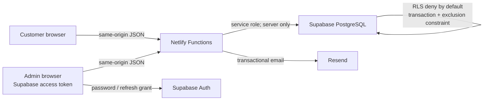

# VELORA Detail Lab

Production-oriented booking-system code for the fictional VELORA Detail Lab automotive detailing studio in Riga. The repository contains the React storefront, same-origin Netlify Functions, Supabase migrations, administrator interface, Resend notifications and deterministic verification workflows.

Public portfolio: <https://auto-velora.netlify.app/>

> The committed public mode is still `demo`. It does not transmit or store form data. The API code must not be enabled until Supabase, Resend and Netlify are configured in a Deploy Preview and the launch checklist passes.

## Architecture



- `src/` contains the React 19 storefront, API booking flow, secure public booking-management page and `/admin` application.
- `netlify/functions/` is the only public write boundary for booking data.
- `supabase/migrations/` owns schema, RLS, booking transactions and audited administrator updates.
- `src/shared/` contains browser/server contracts, pricing, token security and lifecycle rules.
- `submissionMode` supports `demo`, deprecated `googleForms` and `api`; normal builds remain `demo`.

See [architecture](docs/architecture.md), [database](docs/database.md), [security](docs/security.md), [deployment](docs/deployment.md) and [administrator guide](docs/admin-guide.md).

## Booking lifecycle

```text
requested ──> confirmed ──> in_progress ──> completed
    │             │              │
    ├─> rejected  ├─> no_show     └─> cancelled
    └─> cancelled └─> cancelled
```

`BOOKING_APPROVAL_MODE` defaults to `manual`. Requested bookings do not reserve a bay permanently. Confirmation rechecks the selected bay in the database; if another confirmed or in-progress booking now overlaps, PostgreSQL rejects the action and the API returns `409`.

Automatic mode inserts a confirmed booking transactionally. A GiST exclusion constraint prevents overlapping confirmed/in-progress bookings for one bay even under concurrent requests.

## Local setup

Requirements:

- Node.js 24 (Node 20 or newer is supported by the application packages);
- npm;
- Docker and Supabase CLI only for local database integration;
- Netlify CLI only when exercising Functions locally.

```bash
npm ci
npm run dev
```

Verification:

```bash
npm run lint
npm run test
npm run test:api
npm run test:schema
npm run build
npx playwright install chromium
npm run test:e2e
```

Playwright uses mocked API/Auth responses and Vite's isolated `e2e` mode. It never calls production Supabase or Resend. The browser tests cover booking, secure status/cancellation, administrator sign-in/status change and browser-storage privacy.

For local PostgreSQL verification:

```bash
supabase start
supabase db reset
supabase test db
bash scripts/test-concurrent-booking.sh
```

The last command intentionally races two confirmed inserts and expects the second one to fail at the database constraint.

## Supabase setup

Migrations run in filename order:

1. `202607230001_phase2_schema.sql` — extensions, enums, tables, indexes, triggers, RLS and privileges.
2. `202607230002_booking_rpcs.sql` — atomic rate limiting, transactional booking creation and token-protected cancellation.
3. `202607230003_admin_operations.sql` — validated, audited administrator updates.

`supabase/seed.sql` loads the current vehicle categories, services, packages, package mappings, one bay and business hours. It contains no customer data.

For a new non-production project:

```bash
supabase link --project-ref <TEST_PROJECT_REF>
supabase db push --dry-run
supabase db push
```

Apply and inspect these migrations in a dedicated test project first. Do not paste database passwords, service-role keys or access tokens into source control, issues or pull-request comments.

Create the first Auth user manually in the Supabase dashboard, then add its UUID:

```sql
insert into public.admin_profiles (user_id, role, display_name, is_active)
values ('<AUTH_USER_UUID>', 'admin', '<REAL_DISPLAY_NAME>', true);
```

Do not create a shared or fake production password. Disable public Auth sign-up.

## Environment variables

Copy `.env.example` to an ignored local `.env`. Values shown below are classifications, not configured credentials.

| Variable | Scope | Required for API | Notes |
|---|---|---:|---|
| `SUPABASE_URL` | server | yes | Supabase project URL |
| `SUPABASE_ANON_KEY` | server | yes | Used to validate Auth users |
| `SUPABASE_SERVICE_ROLE_KEY` | server secret | yes | Functions only; never `VITE_` |
| `VITE_SUPABASE_URL` | browser | admin only | Safe public project URL |
| `VITE_SUPABASE_ANON_KEY` | browser | admin only | Supabase public anon key |
| `RESEND_API_KEY` | server secret | email | Functions only |
| `RESEND_FROM_EMAIL` | server | email | Must use a verified sender |
| `BOOKING_OWNER_EMAIL` | server/private | email | Real owner inbox required |
| `PUBLIC_SITE_URL` | server | yes | Exact preview/site origin, no trailing slash |
| `BOOKING_APPROVAL_MODE` | server | optional | `manual` default; or `automatic` |
| `STUDIO_TIMEZONE` | server | optional | Defaults to `Europe/Riga` |
| `BOOKING_MIN_NOTICE_HOURS` | server | optional | Defaults to `24` |
| `BOOKING_MAX_DAYS_AHEAD` | server | optional | Defaults to `90` |
| `BOOKING_CANCELLATION_HOURS` | server | optional | Defaults to `24` |
| `BOOKING_BUFFER_MINUTES` | server | optional | Defaults to `30` |
| `RATE_LIMIT_SECRET` | server secret | yes | Strong random secret; also derives retry-stable access tokens |
| `TURNSTILE_SECRET_KEY` | server secret | optional | Enables server verification |
| `VITE_TURNSTILE_SITE_KEY` | browser | optional | Pair with the server secret |

Never expose the service-role key, Resend key, rate-limit secret or Turnstile secret to Vite.

## Resend

1. Verify the real sending domain in Resend.
2. Add `RESEND_API_KEY`, `RESEND_FROM_EMAIL` and `BOOKING_OWNER_EMAIL` to the Netlify preview environment.
3. Submit a non-personal test booking.
4. Confirm both notification records and delivery.

A provider failure is logged as `failed` but does not roll back a committed booking. Internal notes are never included in email.

## Netlify

`netlify.toml` builds `dist`, bundles Functions, maps `/api/*` before the SPA fallback, disables function caching and applies restrictive headers. CSP allows only local assets, the deprecated Google Forms destination and optional Cloudflare Turnstile.

Set the production branch to `main`. Use a pull-request Deploy Preview for Phase 2; do not publish the feature branch to production. Full preview and rollback steps are in [deployment.md](docs/deployment.md).

## Testing and CI

`.github/workflows/ci.yml` runs `npm ci`, lint, Vitest, static migration validation, production build and mocked Chromium Playwright tests on pull requests to `main`. It has read-only repository permission and no deployment step.

`.github/workflows/database-integration.yml` is manual. It starts isolated local Supabase, applies migrations/seed, runs pgTAP tests and verifies the concurrent-overlap constraint. It uses no cloud secrets.

Tests never call live Resend or production Supabase.

## Privacy and business configuration

These values deliberately remain `null` in `src/config/site.ts` until the real owner supplies them:

- booking email and phone;
- Riga address;
- Instagram URL;
- data-controller identity;
- privacy contact and deletion-request method;
- retention period.

Legal basis and the final privacy wording require owner/legal review. `CURRENT_CONSENT_POLICY_VERSION` is shared between the browser and API; stale or invented versions are rejected.

## Backup, recovery and rollback

- Enable Supabase backups appropriate to the selected plan and document restore ownership.
- Before migrations, capture a verified backup and test recovery in a separate project.
- Database migrations are forward-only; create a corrective migration instead of editing an applied migration.
- Roll back frontend/Functions through a previously verified Netlify deploy.
- If API behavior is unsafe, restore the committed `demo` mode while preserving booking records for controlled recovery.
- Rotate any secret that may have appeared in logs, screenshots or client code.

## Current limitations

- External Supabase, Resend and Netlify environments are not configured by this repository change.
- The public site remains in demo mode.
- Database integration must run in the manual workflow or a local Supabase instance.
- Administrator interface copy is English; customer booking and management states support EN/LV/RU.
- Email sending is synchronous best-effort; a durable queue is recommended at higher volume.
- Rate-limit rows are lazily deleted during new checks; scheduled cleanup can be added later.
- CSV exports contain personal data and require an administrator role, but organizational handling and deletion procedures still need to be defined.
- Google Forms remains only for rollback compatibility and is deprecated.

The system must not be described as operational until migrations, preview configuration, real email delivery and a non-production end-to-end booking have been verified.
