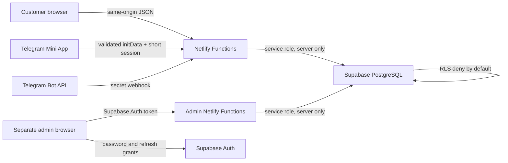

# VELORA Detail Lab

Production-oriented Supabase booking and studio-operations system for the existing VELORA React website. The storefront design and EN/LV/RU experience are preserved while the public catalog, condition estimates, booking availability, customer media and administrator operations use persisted data.

Public site: <https://autodetailing-velora.netlify.app/>

## Architecture



- `src/` contains the visually unchanged storefront and its API booking form.
- `src/telegram/` is the adaptive `/telegram` client; it reuses the same public catalog, availability and booking engine.
- `netlify/functions/create-reservation.ts` is the public booking write boundary.
- `admin/` is the separate authenticated React application and its own Netlify Functions.
- `supabase/migrations/` creates the schema, explicit deny-by-default RLS policies, atomic rate limits, private media, notification outbox, transactional booking insertion, and audited admin updates.
- `supabase/seed.sql` loads the vehicle, service, package, bay, and business-hours catalog.
- `supabase/test-data.sql` is optional fictional data for local or staging testing only.

## Local setup

```bash
npm ci
copy .env.example .env
npm run dev
```

Do not commit `.env`. The production booking path is the default; use `VITE_SUBMISSION_MODE=demo` only for isolated frontend work.

Verification:

```bash
npm run lint
npm run test
npm run test:vitest
npm run test:schema
npm run build
npm --prefix admin run lint
npm --prefix admin run typecheck
npm --prefix admin run test
npm --prefix admin run build
```

## Supabase setup

Apply every file in `supabase/migrations/` in filename order. The migrations are additive, preserve the legacy Phase 2 records when present, and include the commercial operations, notification delivery, customer privacy, legal configuration, private storage, and security/index hardening changes. Never edit a migration already applied to a shared project.

With the Supabase CLI:

```bash
supabase link --project-ref <PROJECT_REF>
supabase db push --dry-run
supabase db push
supabase db seed
supabase test db
```

`supabase/tests/002_duration_scheduling.sql` verifies the database objects and overlap constraint. The exact ten scheduling scenarios—including overnight transfer, closed days, three-bay capacity, no cross-bay combination, conflict, and Riga DST—are covered by the Vitest scheduling suite. Run Supabase database tests against a disposable local or branch database, not production.

Create the first administrator in Supabase Auth, disable public sign-up, and then add the Auth UUID:

```sql
insert into public.admin_profiles (user_id, role, display_name, active)
values ('<AUTH_USER_UUID>', 'admin', '<REAL_DISPLAY_NAME>', true);
```

## Environment variables

Set these in Netlify, using the existing Supabase project values:

| Variable | Exposure | Required |
|---|---|---:|
| `SUPABASE_URL` | Functions | yes |
| `SUPABASE_ANON_KEY` | Functions | yes |
| `SUPABASE_SERVICE_ROLE_KEY` | Functions secret | yes |
| `VITE_SUPABASE_URL` | Browser | admin project only |
| `VITE_SUPABASE_ANON_KEY` | Browser | admin project only |
| `PUBLIC_SITE_URL` | Functions | yes |
| `RATE_LIMIT_SECRET` | Functions secret | yes |
| `BOOKING_APPROVAL_MODE` | Functions | optional, defaults to `manual` |
| `STUDIO_TIMEZONE` | Functions | optional, defaults to `Europe/Riga` |
| `BOOKING_MIN_NOTICE_HOURS` | Functions | optional, defaults to `24` |
| `BOOKING_MAX_DAYS_AHEAD` | Functions | optional, defaults to `90` |
| `BOOKING_BUFFER_MINUTES` | Functions | optional, defaults to `30` |
| `TURNSTILE_SECRET_KEY` | Functions secret | optional |
| `VITE_TURNSTILE_SITE_KEY` | Browser | optional |
| `NOTIFICATION_MODE` | Functions | yes: `disabled`, `test`, or `live` |
| `NOTIFICATION_TEST_RECIPIENT` | Functions | recommended during provider verification |
| `RESEND_API_KEY` | Functions secret | required only in `live` mode |
| `RESEND_FROM_EMAIL` | Functions | required only in `live` mode |
| `BOOKING_OWNER_EMAIL` | Functions | required for administrator notifications in `live` mode |
| `TELEGRAM_BOT_TOKEN` | Functions secret | required for Telegram authentication, bot and live delivery |
| `TELEGRAM_WEBHOOK_SECRET` | Functions secret | required for the Bot API webhook |
| `TELEGRAM_SESSION_SECRET` | Functions secret | required; independent random value of 32+ characters |
| `TELEGRAM_MINI_APP_URL` | Functions | exact public `/telegram` HTTPS URL |
| `TELEGRAM_NOTIFICATION_MODE` | Functions | `disabled`, `test`, or `live` |
| `TELEGRAM_TEST_CHAT_ID` | Functions | required only for controlled test delivery |

Never use a `VITE_` prefix for `SUPABASE_SERVICE_ROLE_KEY`, `RATE_LIMIT_SECRET`, or a Turnstile secret.

## Security model

- Money is stored in integer euro cents.
- The server ignores browser prices, reloads active catalog entries, and recalculates totals.
- Every booking stores service-name, service-price, vehicle-multiplier and calculated-price snapshots. Package bookings also store package name, price, duration, and buffer snapshots.
- Customer, vehicle, booking, item, history, content, notification and admin tables have RLS enabled, explicit server-only deny policies, and no browser table grants.
- The service-role key exists only in Netlify Functions.
- Booking writes are transactional and idempotent.
- Three independent bays provide concurrent capacity. Each reservation stays on
  one bay, is split into Riga-time daily work segments, and continues on the
  next open day when its duration exceeds the remaining business hours.
- PostgreSQL exclusion constraints reject overlapping reservation segments or
  manual blocks for the same bay, including concurrent requests.
- One private database scheduling engine powers public availability, public
  creation, admin previews, editing, and rescheduling. Search increments and
  pending-capacity hold time are configurable in the admin settings.
- Expired public holds release capacity and append an auditable history entry.
- Honeypot, body-size limits, field lengths, origin checks, optional Turnstile, and atomic database rate limiting protect the public endpoint.
- Vehicle photographs use a private Storage bucket, path-bound signed uploads, server-side object verification, short-lived signed previews, metadata-stripping browser re-encoding where supported, and audited administrator removal.
- Notification events are idempotently queued and claimed with `skip locked`; missing provider credentials never break booking.
- Telegram `initData` is HMAC-validated on the server with freshness checks. `initDataUnsafe`, browser prices and browser identity fields are never trusted.

## Business configuration

The administrator Settings page is the central source for the public business name, legal entity, registration number, contact actions, address/map, social links, timezone, retention period, booking terms, cancellation policy, privacy notice and photo-processing explanation. Missing owner-supplied values are warned about in admin and hidden cleanly in public; no company facts are invented.

The new compact administration application is a separate project under [`admin/`](admin/README.md). See the [separate public/admin deployment guide](docs/separate-admin-deployment.md) for the shared Supabase migration, two-Netlify-project setup, and first-administrator procedure.

See [Telegram Mini App setup](docs/telegram-mini-app.md), [commercial operations](docs/commercial-operations.md), [deployment instructions](docs/deployment.md), [database design](docs/database.md), and the [administrator guide](docs/admin-guide.md).
