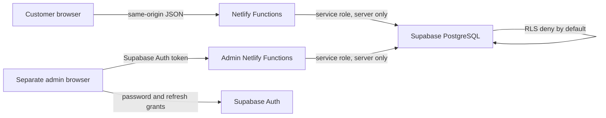

# VELORA Detail Lab

Production-ready Supabase booking backend for the existing VELORA React website. The storefront design, responsive behavior, price estimator, and EN/LV/RU content are preserved.

Public site: <https://autodetailing-velora.netlify.app/>

## Architecture



- `src/` contains the visually unchanged storefront and its API booking form.
- `netlify/functions/create-reservation.ts` is the public booking write boundary.
- `admin/` is the separate authenticated React application and its own Netlify Functions.
- `supabase/migrations/` creates the schema, RLS, atomic rate limits, transactional booking insertion, and audited admin updates.
- `supabase/seed.sql` loads the vehicle, service, package, bay, and business-hours catalog.
- `supabase/test-data.sql` is optional fictional data for local or staging testing only.

## Local setup

```bash
npm ci
copy .env.example .env
npm run dev
```

Do not commit `.env`. The production booking path is the default; use `VITE_SUBMISSION_MODE=demo` only for isolated frontend work.

Verification:

```bash
npm run lint
npm run test
npm run test:vitest
npm run test:schema
npm run build
npm --prefix admin run lint
npm --prefix admin run typecheck
npm --prefix admin run test
npm --prefix admin run build
```

## Supabase setup

Apply the files in order to the existing Supabase project. The first and third
migrations preserve and upgrade records from the earlier Phase 2 schema when it
is present; they are safe no-ops for a new project:

1. `202608130000_prepare_legacy_phase2.sql`
2. `202608130001_booking_schema.sql`
3. `202608130002_copy_legacy_phase2.sql`
4. `202608130003_booking_functions.sql`
5. `202608130004_admin_functions.sql`
6. `20260813173207_admin_schedule_v2.sql`
7. `20260813173324_admin_schedule_indexes_v2.sql`
8. `20260813174644_reservation_no_show_status.sql`
9. `20260813174652_reservation_no_show_function.sql`
10. `20260814084614_duration_based_scheduling.sql`
11. `20260814092056_duration_scheduling_hardening.sql`
12. `20260814095124_reservation_expired_status.sql`
13. `20260814095137_scheduling_engine_completion.sql`
14. `20260814101233_scheduling_engine_fixes.sql`
15. `20260814101413_scheduling_defaults_and_package_safety.sql`
16. `20260814102055_fix_admin_transaction_ambiguity.sql`
17. `supabase/seed.sql`

With the Supabase CLI:

```bash
supabase link --project-ref <PROJECT_REF>
supabase db push --dry-run
supabase db push
supabase db seed
supabase test db
```

`supabase/tests/002_duration_scheduling.sql` verifies the database objects and overlap constraint. The exact ten scheduling scenarios—including overnight transfer, closed days, three-bay capacity, no cross-bay combination, conflict, and Riga DST—are covered by the Vitest scheduling suite. Run Supabase database tests against a disposable local or branch database, not production.

Create the first administrator in Supabase Auth, disable public sign-up, and then add the Auth UUID:

```sql
insert into public.admin_profiles (user_id, role, display_name, active)
values ('<AUTH_USER_UUID>', 'admin', '<REAL_DISPLAY_NAME>', true);
```

## Environment variables

Set these in Netlify, using the existing Supabase project values:

| Variable | Exposure | Required |
|---|---|---:|
| `SUPABASE_URL` | Functions | yes |
| `SUPABASE_ANON_KEY` | Functions | yes |
| `SUPABASE_SERVICE_ROLE_KEY` | Functions secret | yes |
| `VITE_SUPABASE_URL` | Browser | admin project only |
| `VITE_SUPABASE_ANON_KEY` | Browser | admin project only |
| `PUBLIC_SITE_URL` | Functions | yes |
| `RATE_LIMIT_SECRET` | Functions secret | yes |
| `BOOKING_APPROVAL_MODE` | Functions | optional, defaults to `manual` |
| `STUDIO_TIMEZONE` | Functions | optional, defaults to `Europe/Riga` |
| `BOOKING_MIN_NOTICE_HOURS` | Functions | optional, defaults to `24` |
| `BOOKING_MAX_DAYS_AHEAD` | Functions | optional, defaults to `90` |
| `BOOKING_BUFFER_MINUTES` | Functions | optional, defaults to `30` |
| `TURNSTILE_SECRET_KEY` | Functions secret | optional |
| `VITE_TURNSTILE_SITE_KEY` | Browser | optional |

Never use a `VITE_` prefix for `SUPABASE_SERVICE_ROLE_KEY`, `RATE_LIMIT_SECRET`, or a Turnstile secret.

## Security model

- Money is stored in integer euro cents.
- The server ignores browser prices, reloads active catalog entries, and recalculates totals.
- Every booking stores service-name, service-price, vehicle-multiplier and calculated-price snapshots. Package bookings also store package name, price, duration, and buffer snapshots.
- Customer, vehicle, booking, item, history, and admin tables have RLS enabled and no public row policies.
- The service-role key exists only in Netlify Functions.
- Booking writes are transactional and idempotent.
- Three independent bays provide concurrent capacity. Each reservation stays on
  one bay, is split into Riga-time daily work segments, and continues on the
  next open day when its duration exceeds the remaining business hours.
- PostgreSQL exclusion constraints reject overlapping reservation segments or
  manual blocks for the same bay, including concurrent requests.
- One private database scheduling engine powers public availability, public
  creation, admin previews, editing, and rescheduling. Search increments and
  pending-capacity hold time are configurable in the admin settings.
- Expired public holds release capacity and append an auditable history entry.
- Honeypot, body-size limits, field lengths, origin checks, optional Turnstile, and atomic database rate limiting protect the public endpoint.

## Business configuration

The following remain deliberately unconfigured in `src/config/site.ts`: booking email, phone, Riga address, Instagram URL, privacy contact, data-controller identity, and retention period. Replace these only with real owner-approved values.

The new compact administration application is a separate project under [`admin/`](admin/README.md). See the [separate public/admin deployment guide](docs/separate-admin-deployment.md) for the shared Supabase migration, two-Netlify-project setup, and first-administrator procedure.

See [deployment instructions](docs/deployment.md), [database design](docs/database.md), and the [administrator guide](docs/admin-guide.md).
