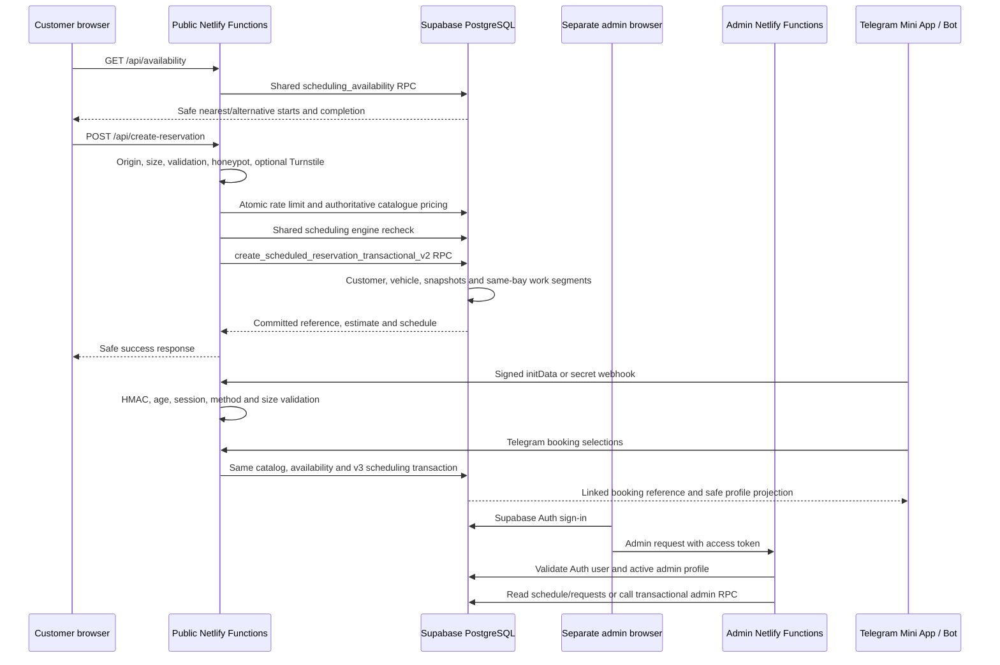

# Architecture

## Runtime boundaries

The two Netlify projects share one Supabase project but no source runtime or deployment. The public browser never reads private reservation tables. The service-role key exists only in Functions. The admin browser receives the Supabase URL and anon key only for Auth; every protected function validates the access token and `admin_profiles.active` before accessing operational data.

## Applications

- Root `src/` is the existing public VELORA site. Its appearance, EN/LV/RU translations, estimator, gallery, animation, and responsive layout remain unchanged.
- `netlify/functions/create-reservation.ts` is the public write boundary. The browser supplies a requested start and catalogue selections, but never a trusted price, duration, bay, or end time.
- `admin/` is a separate React and TypeScript application with its own build, environment file, Netlify configuration, and serverless functions.
- `src/telegram/` is a route-scoped adaptive client. `telegram-auth`, `telegram-profile`, `telegram-booking`, and `telegram-webhook` are server-only identity/data boundaries; they never expose the Supabase service role or Bot token.
- The public function schedules only after verifying the complete duration on one bay. Administrators can create, reschedule, block, cancel, and complete work from the separate admin site.

## Admin endpoints

| Route | Method | Purpose |
|---|---|---|
| `/api/schedule` | GET | Authenticated three-bay timeline and active catalogue |
| `/api/requests` | GET | Authenticated unassigned-request search |
| `/api/reservation` | GET/POST | Detail, preview, transactional create/update, release, block, or unblock |
| `/api/settings` | GET/POST | Authenticated bay and business-calendar configuration |

Responses use `Cache-Control: no-store`. Errors are normalized and do not include database or credential details.

## Database ownership

- `customers` and `vehicles` store normalized customer and vehicle data.
- `services` and `service_packages` are the authoritative multilingual catalogue with integer-cent prices, work minutes, buffers, and active state.
- `reservations` stores pending holds and operational reservations, sources, final-duration overrides, expiry, release state, and package snapshots.
- `reservation_services` stores name, integer-cent price, duration, and buffer snapshots.
- `reservation_segments` stores timezone-aware daily work ranges on one bay.
- `blocked_periods` stores manual bay closures.
- `business_hours` and `business_hour_exceptions` define the effective Riga calendar.
- `reservation_history` stores the audit trail.
- `admin_profiles` authorizes Supabase Auth users.

All exposed operational tables use RLS with explicit deny policies for browser roles. A GiST exclusion constraint on `(work_bay_id, tstzrange(segment_start, segment_end, '[)'))` is the database scheduling authority, so adjacent work is valid while overlap is rejected. Reservation and segment writes run in one PostgreSQL transaction. Cancellation, expiry and `no_show` release future capacity without deleting audit history. Completed work retains its plan unless an administrator explicitly confirms release.

## Duration schedule

The default calendar is 10:00-20:00 every day in `Europe/Riga`, with a configurable start interval that defaults to 30 minutes. Administrators can close a weekday, add a holiday, set special hours, deactivate a bay, and configure service/package work and buffer minutes. A long service is divided into one segment per open day and always continues on the same bay.
