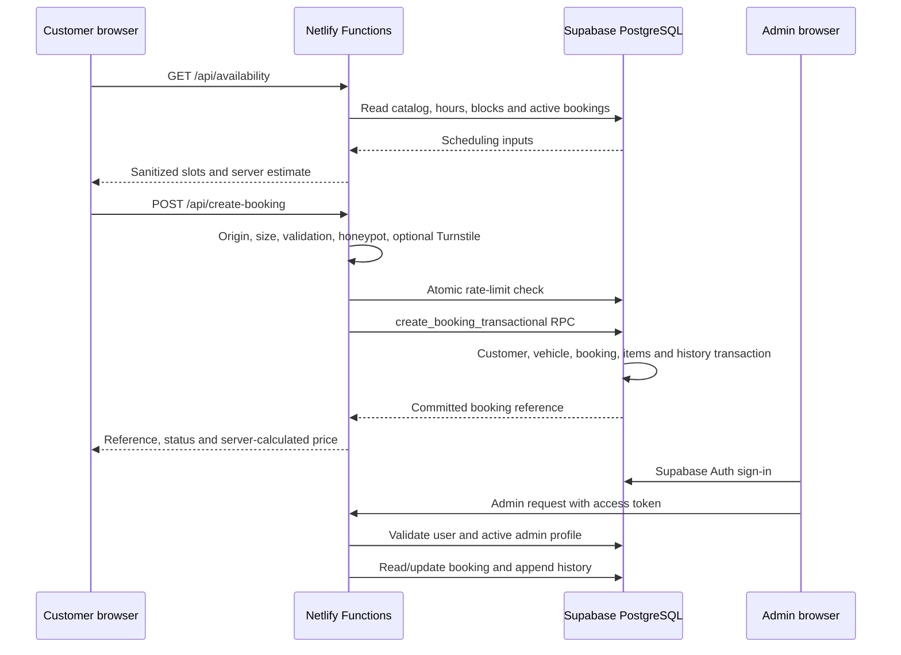

# Architecture

## Runtime boundaries

The public browser never writes directly to booking tables. The Supabase service-role key exists only in Netlify Functions. The admin browser receives only the public project URL and anon key; every protected function revalidates the Supabase access token and the matching active `admin_profiles` record.

## Frontend

- `App.tsx` routes `/`, `/booking` and `/admin` without another routing dependency.
- `Booking.tsx` chooses the configured submission mode; production defaults to the API flow.
- `ApiBooking.tsx` loads slots, validates customer input, prevents duplicate submissions and displays only the committed server result.
- `AdminApp.tsx` signs in with Supabase Auth and provides booking search, filters, details, status changes, internal notes and booking history.
- The public site retains the existing EN/LV/RU language system and design.
- Only non-sensitive interface preferences are persisted for public visitors.

## Backend endpoints

| Route | Method | Purpose |
|---|---|---|
| `/api/availability` | GET | Server-priced, capacity-aware slots |
| `/api/create-booking` | POST | Validated, rate-limited transactional booking creation |
| `/api/bookings` | POST | Backward-compatible alias for booking creation |
| `/api/booking-status` | GET | Token-protected public status view |
| `/api/booking-cancel` | POST | Token-protected cancellation |
| `/api/admin-bookings` | GET | Authenticated list, detail, summary and CSV |
| `/api/admin-booking-action` | POST | Authenticated status and internal-note updates |
| `/api/admin-blocks` | GET/POST/DELETE | Authenticated availability management |

All responses use `Cache-Control: no-store` and a correlation/request ID. Logs use an allow-list and exclude names, email addresses, phone numbers, messages, request bodies, access tokens and authorization headers.

## Database ownership

- `customers` and `vehicles` hold normalized customer and vehicle records.
- `services` is the authoritative active service catalog.
- `booking_requests` holds the request, schedule and complete vehicle/price snapshots.
- `booking_items` holds immutable per-service name, base-price, multiplier, calculated-price and duration snapshots.
- `admin_profiles` authorizes authenticated administrators.
- `booking_history` records status and internal-note changes.
- Monetary values are integer euro cents; vehicle multipliers are integer basis points.

RLS is enabled on every exposed table. Public roles have no direct read, insert, update or delete policies. All public booking writes go through the server-side transaction RPC.

## Availability policy

Business hours, active work bays, blocks, buffer time, minimum notice, booking horizon and the Riga timezone feed slot generation. Confirmed and in-progress bookings consume capacity. A PostgreSQL exclusion constraint prevents overlapping active work in the same bay, including concurrent requests.

## Failure behavior

- Invalid or malformed input: `400` or `422`.
- Unauthorized/forbidden admin: `401`/`403`.
- Lost slot, duplicate idempotency key or invalid lifecycle transition: `409`.
- Rate limit: `429`.
- Missing server configuration or provider outage: sanitized `503` where appropriate.
- Unknown failure: sanitized `500` with a correlation ID.
