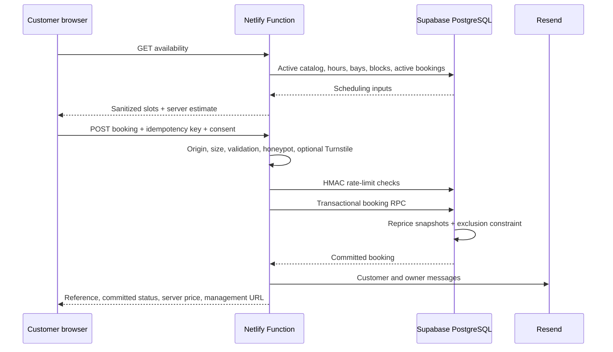

# Architecture

## Runtime boundaries

The browser never writes directly to booking tables. The Supabase service-role key exists only in Netlify Functions. Admin browser authentication uses the public Supabase URL/anon key; every protected API call revalidates the access token and active `admin_profiles` record.

## Frontend

- `App.tsx` routes `/`, `/booking` and `/admin` without an additional router dependency.
- `Booking.tsx` selects `demo`, deprecated `googleForms` or `api`.
- `ApiBooking.tsx` loads slots, locks duplicate submissions and displays only the server-committed status.
- `BookingManager.tsx` reads reference/token once, removes them from the visible URL immediately and requires both for every status/cancellation call.
- `AdminApp.tsx` signs in with Supabase Auth, lists/searches bookings, performs lifecycle actions, manages blocked periods and downloads CSV.
- Only language preference is persisted for public users.

## Backend endpoints

| Route | Method | Purpose |
|---|---|---|
| `/api/availability` | GET | Server-priced, capacity-aware slots |
| `/api/bookings` | POST | Validated, rate-limited transactional booking |
| `/api/booking-status` | GET | Token-protected public view |
| `/api/booking-cancel` | POST | Token-protected cancellation |
| `/api/admin-bookings` | GET | Authenticated list/detail/summary/CSV |
| `/api/admin-booking-action` | POST | Authenticated status, timing, notes and final price |
| `/api/admin-blocks` | GET/POST/DELETE | Authenticated availability management |

All responses use no-store semantics and carry a correlation/request ID. Logs contain outcome metadata, not names, email, phone, notes, request bodies, access tokens or authorization headers.

## Modes

- `demo`: committed default; browser-only portfolio demonstration.
- `googleForms`: deprecated compatibility transport; not reliable enough for professional bookings.
- `api`: professional flow; enabled only after the deployment gate passes.
- `e2e`: Vite test mode activates API UI against Playwright route mocks. It is not a production submission mode.

## Availability policy

Business hours, active bays, global/bay blocks, buffer time, minimum notice, booking horizon and Riga timezone feed slot generation. Confirmed and in-progress bookings consume capacity. Requested bookings do not; manual confirmation rechecks availability transactionally.

## Failure behavior

- Invalid input: `400` or `422`.
- Unauthorized/forbidden admin: `401`/`403`.
- Lost slot or invalid lifecycle transition: `409`.
- Rate limit: `429`.
- Missing server configuration/provider outage: `503` where appropriate.
- Unknown failure: sanitized `500`, with correlation ID.
- Resend failure: booking remains committed; notification state is reported separately.
